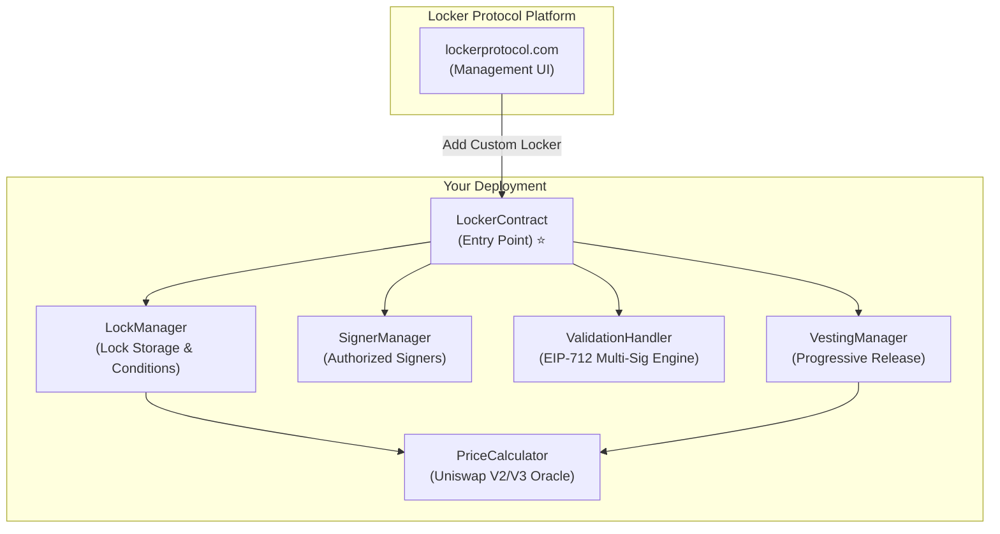

# 🔒 Locker Protocol — Smart Contracts

[](https://github.com/locker-protocol/locker-protocol-smart-contracts/actions/workflows/tests.yml)


> **Ultra-secure ERC-20 token locking with multi-signature, air-gapped signing (EIP-712 + QR codes), on-chain price conditions, and progressive vesting.**

Deploy your own Locker smart contracts on any EVM chain and register them on [lockerprotocol.com](https://lockerprotocol.com).

---

## 📚 Table of Contents

1. [Overview](#overview)
2. [Architecture](#architecture)
3. [Smart Contracts](#smart-contracts)
4. [Quick Start](#quick-start)
5. [Testing](#testing)
6. [Deploy on Mainnet](#deploy-on-mainnet)
7. [Register on Locker Protocol](#register-on-locker-protocol)
8. [Supported Chains](#supported-chains)
9. [Security](#security)
10. [License](#license)

---

## Overview

Locker Protocol allows any entity to deploy its own **vault infrastructure** using a modular smart contract architecture. A group of **signers** (3 to 20) manages locked assets via **multi-signature (M-of-N) logic** with offline signing support (EIP-712 + QR codes).

### Key Features

- 🔐 **Multi-Signature Security** — M-of-N threshold signing (minimum 3 signers)
- 🛡️ **Air-Gapped Signing** — Sign transactions offline via EIP-712 + animated QR codes
- 💰 **Flexible Lock Conditions** — Time-based, price-based (Uniswap V2/V3 oracle), or both
- 📈 **Progressive Vesting** — Gradual token release with token-denominated schedules (optional accumulation)
- 🔄 **Replay Protection** — Per-operation nonces prevent signature reuse
- 🌐 **Multi-Chain** — Deploy on Ethereum, BSC, Polygon, Arbitrum, Base, and more
- 📋 **Deployment Registry** — On-chain factory for managing deployed Locker instances

---

## Architecture



---

## Smart Contracts

All contracts use `Solidity ^0.8.20` with OpenZeppelin primitives.

| Contract                | Role                                                             |
| ----------------------- | ---------------------------------------------------------------- |
| **`LockerContract`**    | Central entry point — delegates to all modules, manages nonces   |
| **`LockManager`**       | Lock storage, time/price condition evaluation, token accounting  |
| **`SignerManager`**     | Authorized signer list, M-of-N threshold management              |
| **`ValidationHandler`** | Multi-sig engine, EIP-712 signature verification via `ecrecover` |
| **`VestingManager`**    | Progressive token release with token-denominated schedules       |
| **`PriceCalculator`**   | On-chain price oracle — queries Uniswap V2 reserves and V3 slots |
| **`FullMath`**          | Safe math library for price calculations                         |

### Supporting Libraries

| File                         | Role                                                           |
| ---------------------------- | -------------------------------------------------------------- |
| `LockerContractStructs.sol`  | Shared data structures (`CreateLockParams`, `SignatureParams`) |
| `LockerInternal.sol`         | Internal logic (operation validation, batch approve)           |
| `LockerLockOperations.sol`   | Lock/unlock operations with signature verification             |
| `LockerSignerOperations.sol` | Threshold update with multi-sig                                |
| `LockerViewFunctions.sol`    | Read-only view functions                                       |

### Mock Contracts (Testing Only)

| Contract                | Usage                                  |
| ----------------------- | -------------------------------------- |
| `ERC20Mock`             | Standard ERC-20 token for testing      |
| `ERC20MockWithDecimals` | ERC-20 with custom decimals            |
| `ERC20USDTMock`         | USDT simulation (non-standard approve) |
| `MockUniswapV2Pair`     | Uniswap V2 pool simulation             |
| `MockUniswapV3Pool`     | Uniswap V3 pool simulation             |

---

## Quick Start

### Prerequisites

| Tool        | Version            | Check            |
| ----------- | ------------------ | ---------------- |
| **Node.js** | 22+ (see `.nvmrc`) | `node --version` |
| **NVM**     | Latest             | `nvm --version`  |
| **Git**     | Latest             | `git --version`  |

### Install & Compile

```bash
# Clone the repository
git clone https://github.com/locker-protocol/locker-protocol-smart-contracts.git
cd locker-smart-contracts

# Use the correct Node version
nvm use

# Install dependencies
npm install

# Compile contracts
npx hardhat compile
```

### Deploy Locally (for testing)

```bash
# Terminal 1: Start a local Hardhat node
npx hardhat node

# Terminal 2: Deploy all contracts
npx hardhat run scripts/deploy-local.js --network localhost
```

This deploys:

- All 6 core contracts (LockerContract, LockManager, SignerManager, ValidationHandler, VestingManager, PriceCalculator)
- Mock ERC-20 tokens (WETH, USDT, USDC, DAI)

Deployed addresses are saved to `deployed-addresses.json`.

---

## Testing

[](https://github.com/locker-protocol/locker-protocol-smart-contracts/actions/workflows/tests.yml)

The test suite contains **47 test files** covering all contract functionality — from core locking and vesting to multi-signature governance, replay protection, and edge-case security scenarios.

Tests run on a local Hardhat node with automated setup, compilation, and teardown.

```bash
# Run all tests
npm test

# Run a specific test
cd test
./run_tests.sh 01              # By number
./run_tests.sh basic           # By keyword
./run_tests.sh 01 03 05        # Multiple tests
```

### Test Categories

#### 🔒 Core Locking

| ID | Test | Description |
|----|------|-------------|
| 00 | `00-setup.js` | Deploy contracts, configure signers and tokens (always runs first) |
| 01 | `01-basic-lock.js` | Create a lock, add tokens, verify balances and lock state |
| 02 | `02-price-lock.js` | Create locks with on-chain price conditions (Uniswap oracles) |
| 07 | `07-lock-history.js` | Verify lock history tracking and event logs |
| 30 | `30-get-all-locks.js` | Retrieve and paginate all locks across many tokens (stress test) |
| 40 | `40-multilock-surplus.js` | Multi-lock operations and surplus token handling |
| 44 | `44-zero-duration-lock.js` | Zero-duration locks are immediately time-unlockable |
| 90 | `90-lock-closure-with-history.js` | Closing a lock is constant-cost regardless of accumulated history; duration bound |
| 91 | `91-lock-closure-and-duration-bounds.js` | Regular and vesting closure cost, history retention, and `MAX_LOCK_DURATION` bounds |

#### 💰 Price Conditions & Oracles

| ID | Test | Description |
|----|------|-------------|
| 05 | `05-price-conditions.js` | UPSIDE / DOWNSIDE price condition logic |
| 09 | `09-target-price-immutable.js` | Verify target price cannot be modified after lock creation |
| 31 | `31-exhaustive-prices.js` | Exhaustive price calculation scenarios (edge cases) |
| 32 | `32-reference-pools.js` | Reference pool configurations for multiple DEX versions |
| 42 | `42-threshold-v3-inverse.js` | Uniswap V3 inverse pair math and threshold edge cases |

#### 📜 Vesting & Unlock

| ID | Test | Description |
|----|------|-------------|
| 10 | `10-eip712-unlock.js` | EIP-712 typed signature unlock flow |
| 18 | `18-vesting-unlock-sig.js` | Progressive vesting with multi-sig unlock |

#### 🔑 Multi-Signature Governance

| ID | Test | Description |
|----|------|-------------|
| 14 | `14-batch-signers.js` | Batch add/remove signers |
| 15 | `15-threshold-update.js` | Update M-of-N threshold with signatures |
| 16 | `16-create-lock-sig.js` | Lock creation requiring multi-sig approval |
| 34 | `34-threshold-under-5.js` | Threshold configurations with fewer than 5 signers |

#### 🛡️ Security & Access Control

| ID | Test | Description |
|----|------|-------------|
| 04 | `04-lock-security.js` | Unauthorized access, invalid inputs, boundary checks |
| 06 | `06-lock-rescue.js` | Multi-sig token rescue with guards against active locks |
| 43 | `43-rescue-lock-lifecycle.js` | Rescue interaction with the full lock lifecycle |
| 45 | `45-rescue-native.js` | Multi-sig native coin rescue (force-sent funds) |
| 36 | `36-signature-malleability.js` | EIP-712 signature malleability protection (ECDSA `s` value) |
| 37 | `37-validation-handler-coverage.js` | Full coverage of validation handler paths |
| 38 | `38-lockmanager-price-coverage.js` | LockManager price logic edge cases |
| 39 | `39-signer-access-coverage.js` | Signer access control exhaustive coverage |
| 35 | `35-v3-math-overflow.js` | Uniswap V3 math overflow protection |

#### 🔁 Replay Protection

| ID | Test | Description |
|----|------|-------------|
| 23 | `23-threshold-replay-protection.js` | Replay protection on threshold updates |
| 25 | `25-batch-signers-replay.js` | Replay protection on batch signer operations |
| 26 | `26-unlock-replay.js` | Replay protection on unlock transactions |
| 27 | `27-create-lock-replay.js` | Replay protection on lock creation |
| 41 | `41-replay-protection.js` | Cross-operation replay protection scenarios |
| 46 | `46-rescue-replay.js` | Replay protection on token and native rescues |

---

## Deploying to EVM Networks

The deployment process is entirely configured via environment variables. You can deploy to any preset EVM chain (with default public RPCs or optional custom RPC overrides) or to any generic EVM chain by specifying its RPC URL and Chain ID.

### Step 1: Configure Environment Variables

Create your `.env` file by copying the template:

```bash
cp .env.example .env
```

Open `.env` and fill in the values:

```env
# ------------------------------------------------------------
# 1. Deployer Credentials (Provide EITHER Private Key OR Mnemonic)
# ------------------------------------------------------------
# If both are set, PRIVATE_KEY takes precedence.
PRIVATE_KEY=0xYourPrivateKeyHere
# OR:
MNEMONIC=word1 word2 word3 ... word12

# ------------------------------------------------------------
# 2. Locker Parameters
# ------------------------------------------------------------
# INITIAL_SIGNERS: Comma-separated list of authorized multi-sig signers (3 to 20).
INITIAL_SIGNERS=0xSigner1,0xSigner2,0xSigner3

# THRESHOLD: Number of required signer approvals (must be >= 3 and <= number of signers).
THRESHOLD=3

# ------------------------------------------------------------
# 3. Uniswap Price Condition / WETH Configuration
# ------------------------------------------------------------
# WETH_ADDRESS: Required for on-chain price evaluation (PriceCalculator).
# Set to the WETH or wrapped native token address of your target chain (see table below).
WETH_ADDRESS=0xC02aaA39b223FE8D0A0e5C4F27eAD9083C756Cc2

# CUSTOM_WETH_ADDRESSES: Optional comma-separated list of additional
# wrapped-native token addresses, registered immutably at deploy time.
# CUSTOM_WETH_ADDRESSES=0xToken1,0xToken2

# ------------------------------------------------------------
# 4. Target Network Configuration (Only required for --network custom / mainnet)
# ------------------------------------------------------------
RPC_URL=https://your-custom-rpc-url-here
CHAIN_ID=1

# ------------------------------------------------------------
# 5. Optional Preset Network RPC Overrides (e.g. for --network base)
# ------------------------------------------------------------
# BASE_RPC_URL=https://mainnet.base.org
# BSC_RPC_URL=https://binance.llamarpc.com
# POLYGON_RPC_URL=https://polygon.llamarpc.com
# ARBITRUM_RPC_URL=https://arbitrum.llamarpc.com
# OPTIMISM_RPC_URL=https://optimism.llamarpc.com
# SEPOLIA_RPC_URL=https://ethereum-sepolia-rpc.publicnode.com
# AMOY_RPC_URL=https://rpc-amoy.polygon.technology
# BSC_TESTNET_RPC_URL=https://bsc-testnet-rpc.publicnode.com
```

### Step 2: Compile Contracts

Compile the contracts using Hardhat:

```bash
npx hardhat compile --force
```

### Step 3: Run Deployment Script

Deploy the contracts to the network of your choice.

#### Option A: Deploy using a Preset Network Name

You can deploy directly to standard networks configured in `hardhat.config.js`. If you haven't set custom RPC overrides in `.env`, the script will automatically use public endpoints:

```bash
# Mainnets
npx hardhat run scripts/deploy.js --network base
npx hardhat run scripts/deploy.js --network arbitrum
npx hardhat run scripts/deploy.js --network bsc
npx hardhat run scripts/deploy.js --network polygon
npx hardhat run scripts/deploy.js --network ethereum
npx hardhat run scripts/deploy.js --network optimism

# Testnets
npx hardhat run scripts/deploy.js --network sepolia
npx hardhat run scripts/deploy.js --network amoy
npx hardhat run scripts/deploy.js --network bscTestnet
```

#### Option B: Deploy to a Custom EVM Chain

To deploy to any EVM chain not preset above, configure `RPC_URL` and `CHAIN_ID` in `.env`, and run the deployment targeting the `custom` network:

```bash
npx hardhat run scripts/deploy.js --network custom
```

### What the Deployment Script Does

The deployment script executes the following steps:

1. ✅ **Validates Configuration** — Checks for active RPC, balance, WETH address validity, signer count (3-20), and threshold rules.
2. 📦 **Deploys Core Modules** — Deploys `PriceCalculator`, `ValidationHandler`, `LockManager`, `SignerManager`, and `VestingManager`.
3. 📦 **Deploys Locker Entry Point** — Deploys `LockerContract` using the module addresses, initial signers, and threshold.
4. 💾 **Saves Deployment Metadata** — Generates a `deployed-addresses-<chainId>.json` metadata file containing all deployed addresses and deployment parameters.
5. 📌 **Prints Integration Guide** — Outputs step-by-step instructions to register your new Locker on the protocol.

---

## Register on Locker Protocol

Once your contracts are deployed, register your Locker on the platform:

1. Go to **[lockerprotocol.com](https://lockerprotocol.com)**
2. Connect your wallet (MetaMask) on the correct network
3. Click **"Add Custom Locker"**
4. Paste your **LockerContract address** (the one marked with ⭐ in the deployment output)
5. Give your Locker a name (optional)
6. Click **"Add Locker"**

Your Locker is now visible and manageable through the Locker Protocol interface! 🎉

---

## Supported Chains

| Chain      | Chain ID | WETH Address                                 |
| ---------- | -------- | -------------------------------------------- |
| Ethereum   | `1`      | `0xC02aaA39b223FE8D0A0e5C4F27eAD9083C756Cc2` |
| BSC        | `56`     | `0xbb4CdB9CBd36B01bD1cBaEBF2De08d9173bc095c` |
| Polygon    | `137`    | `0x7ceB23fD6bC0adD59E62ac25578270cFf1b9f619` |
| Arbitrum   | `42161`  | `0x82aF49447D8a07e3bd95BD0d56f35241523fBab1` |
| Optimism   | `10`     | `0x4200000000000000000000000000000000000006` |
| Base       | `8453`   | `0x4200000000000000000000000000000000000006` |
| Avalanche  | `43114`  | `0xB31f66AA3C1e785363F0875A1B74E27b85FD66c7` |
| Linea      | `59144`  | `0xe5D7C2a44FfDDf6b295A15c148167daaAf5Cf34f` |
| zkSync Era | `324`    | `0x5AEa5775959fBC2557Cc8789bC1bf90A239D9a91` |
| Robinhood  | `4663`   | `0x0Bd7D308f8E1639FAb988df18A8011f41EAcAD73` |

---

## Security

### Multi-Signature (EIP-712)

All critical operations require M-of-N multi-signature approval:

- **Unlock tokens** — requires threshold signatures
- **Rescue tokens or native funds** — requires threshold signatures + nonce
- **Update signers** — requires threshold signatures + nonce
- **Update threshold** — requires threshold signatures + nonce

### Replay Protection

Every signed operation includes a per-operation nonce that is incremented after execution, making signature replay impossible.

### Air-Gapped Signing

Private keys can be kept on a completely offline device. Signature requests and responses are exchanged via animated QR codes using the BC-UR protocol.

### OpenZeppelin Primitives

- `ReentrancyGuard` — protection against reentrancy attacks
- `SafeERC20` — safe token transfer handling
- Checks-Effects-Interactions pattern throughout

### Responsible Disclosure

If you find a vulnerability, please see [SECURITY.md](SECURITY.md) for reporting instructions.

---

## Project Structure

```
locker-smart-contracts/
├── contracts/                  # Solidity smart contracts
│   ├── LockerContract.sol      # Entry point ⭐
│   ├── LockManager.sol         # Lock storage & conditions
│   ├── SignerManager.sol       # Signer management
│   ├── ValidationHandler.sol   # EIP-712 multi-sig engine
│   ├── VestingManager.sol      # Progressive vesting
│   ├── PriceCalculator.sol     # Uniswap V2/V3 oracle
│   ├── FullMath.sol            # Math library
│   └── mocks/                  # Test-only contracts
├── scripts/
│   ├── deploy-local.js         # Local testnet deployment
│   └── deploy.js               # Mainnet deployment
├── test/
│   ├── tests/                  # 33 test files
│   ├── core/utils.js           # Test utilities
│   └── run_tests.sh            # Test runner
├── hardhat.config.js           # Hardhat configuration
├── package.json                # Dependencies
├── .env.example                # Environment template
├── LICENSE                     # Proprietary License
└── SECURITY.md                 # Security policy
```

---

## Compiler Settings

```
Solidity: 0.8.20
Optimizer: enabled (runs: 1)
viaIR: true
```

---

## License

This project is licensed under a proprietary non-commercial license. You are permitted to use, copy, modify, and run the software for non-commercial purposes only. Commercial use, reproduction, redistribution, or commercialization is strictly prohibited. See the [LICENSE](LICENSE) file for details.

---

**Website**: [lockerprotocol.com](https://lockerprotocol.com) · **Security**: [SECURITY.md](SECURITY.md)
